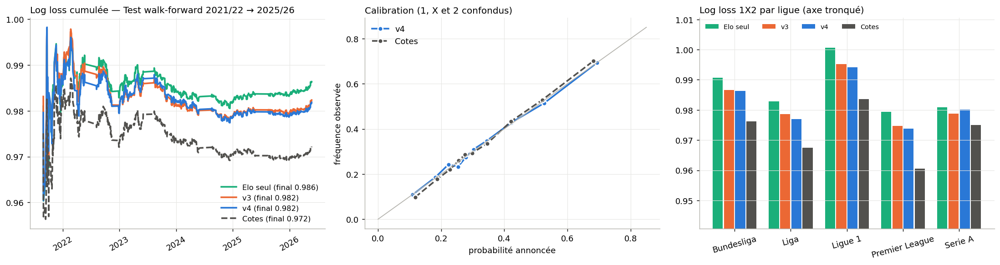

# Prédiction statistique des matchs de football — modèle v4

Projet académique. On construit un **modèle statistique transparent** qui donne, pour un match des 5 grands championnats européens :

- les probabilités **1 / X / 2** en pourcentage,
- les **buts attendus** et la grille des scores exacts,
- les marchés dérivés : over/under, les deux équipes marquent, cage inviolée, but en 1re mi-temps,
- une **cote juste** (1/p) et un **indice de fiabilité**.

Le modèle est évalué selon un **protocole sans fuite d'information** : il est testé sur des saisons qu'il n'a jamais vues, avec des scores probabilistes et des intervalles de confiance.

> ⚠️ Projet de recherche. Aucune stratégie de pari n'est proposée. Le notebook 05 montre, données à l'appui, que le modèle ne bat pas le marché.

---

## Résultats principaux (test 2021/22 → 2025/26, 8 821 matchs)

La log loss est le critère principal : plus elle est basse, mieux c'est. Le skill score est le gain de log loss par rapport aux simples fréquences.

| Modèle | Log loss | RPS | ECE (calibration) | Bon résultat | Skill score |
|---|---|---|---|---|---|
| Fréquences (aucune information) | 1,0737 | 0,2300 | 0,010 | 43,5 % | 0 % |
| Elo seul | 0,9864 | 0,2001 | 0,013 | 52,4 % | 8,1 % |
| v3 | 0,9823 | 0,1990 | 0,013 | 52,9 % | 8,5 % |
| **v4 (final)** | **0,9818** | **0,1989** | **0,011** | 52,6 % | **8,6 %** |
| *Cotes des bookmakers (référence externe)* | *0,9722* | *0,1957* | *0,015* | *53,7 %* | *9,5 %* |

- **v4 bat Elo seul** : −4,5 ×10⁻³, IC 95 % [−6,8 ; −2,2], différence significative.
- **Marchés de buts, v4 contre v3** : −5,2 ×10⁻³ sur le score exact et −4,2 ×10⁻³ sur l'over 2,5. Les deux gains sont significatifs.
- **Calibration** : v4 est le modèle le mieux calibré. Quand il annonce 40 %, l'issue se réalise environ 40 % du temps.
- **Face aux cotes**, l'écart reste de +9,6 ×10⁻³, IC [+6,8 ; +12,3]. Le marché dispose d'informations absentes des données : compositions, blessures, vrais xG.

Détails : [`docs/resultats.md`](docs/resultats.md). Graphiques : `results/figures/`.



---

## Structure du dépôt

```
├── footpred/                  ← le modèle, sous forme de package Python
│   ├── config.py              paramètres (tous fixés avant le test final)
│   ├── data.py                chargement du dataset public
│   ├── ratings.py             pi-ratings + ratings de buts GAS (état conservé pour prédire)
│   ├── features.py            variables d'avant-match sans fuite, état des équipes
│   ├── models.py              logit multinomial (1X2), Poisson + Dixon-Coles (buts)
│   ├── markets.py             marchés dérivés, cotes justes, méthode de Shin
│   ├── evaluation.py          log loss, RPS, Brier, ECE, bootstrap, walk-forward
│   ├── predict.py             Predicteur.simulation(dom, ext)
│   ├── journal.py             suivi en direct : journal horodaté + évaluation
│   ├── labo.py                laboratoire : validation, saison, semaine par semaine, stratégies
│   └── __main__.py            ligne de commande
├── notebooks/
│   ├── 01_exploration_donnees.ipynb   analyse exploratoire du dataset
│   ├── 02_modele_final.ipynb          construction, formules, validation, simulation
│   ├── 03_labo_saison.ipynb           test sur une saison + semaine par semaine
│   ├── 04_suivi_hebdomadaire.ipynb    prédictions en direct et évaluation
│   ├── 05_efficience_marche.ipynb     expérience : le marché est-il battable ?
│   └── archives/                      versions v1 → v4 (historique du projet)
├── tests/                     tests automatiques (absence de fuite, probabilités, bout en bout)
├── app.py                     application web Streamlit
├── .streamlit/config.toml     thème de l'application
├── scripts/reproduire.py      régénère tous les résultats du rapport
├── results/                   tables CSV, figures PNG, classeur Excel
├── journal/                   journal des prédictions en direct
├── docs/                      méthodologie, résultats, plan du rapport, guide, références
└── data/                      cache local du dataset (non versionné)
```

---

## Installation

```bash
git clone https://github.com/abdelkbir1243/football-prediction-stat.git
cd football-prediction-stat
pip install -r requirements.txt
```

**Dans Google Colab**, ouvrir n'importe quel notebook de `notebooks/` : la première cellule clone le dépôt et installe tout.

## Application web (Streamlit)

```bash
streamlit run app.py
```

L'application propose de prédire un match ou une journée, et affiche les performances du modèle et sa méthode. Pour la mettre en ligne gratuitement, suivre [`docs/deploiement_streamlit.md`](docs/deploiement_streamlit.md).

## Utilisation

**En Python / notebook**

```python
from footpred import preparer
pred = preparer()                                   # ≈ 30 s : données, ratings, modèle final
pred.simulation("Arsenal", "Chelsea")               # affichage complet
r = pred.simulation("Inter", "Milan", afficher=False)
print(r["1"], r["X"], r["2"], r["over25"])          # dictionnaire de probabilités
```

**En ligne de commande**

```bash
python -m footpred predire "Arsenal" "Chelsea" --cotes 1.80 3.90 4.50
python -m footpred journee "Arsenal vs Chelsea@2026-10-04" "Inter vs Milan"   # ajoute au journal
python -m footpred evaluer                                                    # note le journal
python -m footpred valider                                                    # test walk-forward 2021-2026
python scripts/reproduire.py --saison 2025                                    # tous les résultats du rapport
python -m pytest tests                                                        # tests automatiques
```

La routine hebdomadaire est décrite dans [`docs/guide_utilisation.md`](docs/guide_utilisation.md).

---

## Méthode en bref

1. **Données** : [xgabora/Club-Football-Match-Data-2000-2025](https://github.com/xgabora/Club-Football-Match-Data-2000-2025). Environ 230 000 matchs, dont les 5 grands championnats depuis 2005. On y trouve les résultats, les tirs, les corners, ClubElo et les cotes.
2. **Ratings** calculés match après match, sur toutes les ligues :
   - **ClubElo** ;
   - **pi-ratings** (Constantinou & Fenton 2013) ;
   - **ratings de buts GAS** (Koopman & Lit 2019), qui estiment la force d'attaque et de défense de chaque équipe.
3. **Variables** : écart d'Elo, |écart d'Elo|, qualité de jeu ΔQ (xG approché par les tirs cadrés), ouverture du match, pi, GAS, ligue et niveau de buts de la ligue.
4. **Modèles** :
   - 1X2 : logit multinomial ;
   - buts : Poisson + Dixon-Coles.
   Les deux sont pondérés dans le temps (demi-vie de 4 saisons).
5. **Protocole** :
   - réglage des ratings sur 2006-2015 ;
   - sélection du modèle sur 2017-2021 ;
   - **test final unique sur 2021-2026**, en walk-forward.

Formules complètes : [`docs/methodologie.md`](docs/methodologie.md).

## Limites

- **Pas d'informations sur les compositions, les blessures ni les vrais xG** : c'est la principale source de l'écart avec les cotes.
- **Ajouter des variables n'aide plus.** Au-delà d'environ 40 variables, le modèle surapprend (voir `docs/resultats.md`).
- **Le dataset est mis à jour avec quelques jours de décalage.**

## Crédits

Données : xgabora (d'après football-data.co.uk et ClubElo). Projet inspiré au départ de [mhaythornthwaite/Football_Prediction_Project](https://github.com/mhaythornthwaite/Football_Prediction_Project). Références : [`docs/references.md`](docs/references.md). Licence MIT.
